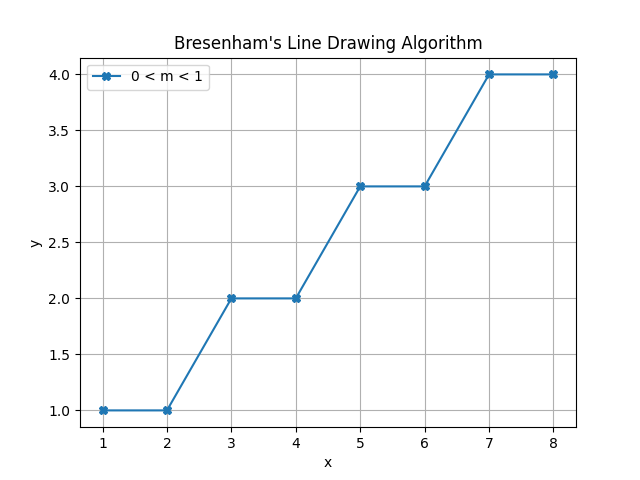

# Lab-task: 01

1. Below is a breakdown of the **adjustments** made for the case where the ***slope (m) is greater than 1***:
  
    (a) Change of Variables: The variables xi and x are introduced to handle the movement along the X-axis for the case where the slope is greater than 1.

        xi = 1  # to go right along with X-axis
        if dx < 0:
            xi = -1  # to go left along with X-axis
            dx = -dx
        x = x0
    The idea here is to iterate over the Y-axis and update the X-coordinate accordingly. The direction of movement (xi) depends on whether the line is moving towards the right or left along the X-axis.

   (b) Base Case Adjustment: The base case condition for the Decision Parameter(D = 2 * dx - dy) is adjusted for the new scenario.
            
          D = 2 * dx - dy  # base case

   (c) Iteration over Y-axis: The loop now iterates over the Y-axis, updating the X-coordinate in each iteration.

        for y in range(y0, y1 + 1):  # incrementing y by 1 in each iteration
        points.append((x, y))
        if D >= 0:
            x = x + xi
            D = D + 2 * dx - 2 * dy
        else:
            # x remains the same here
            D = D + 2 * dx
    
    Similar to the original algorithm, the decision on whether to increase or leave the X co-ordinate unchanged depends on the value of the decision parameter (D).

2. **Output** for the given two test cases:

   (a) Test Case 1: Draw a line from **P1(1, 1)** to **P2(8, 4)**
    
    
   
   (b) Test Case 1: Draw a line from **P1(1, 1)** to **P2(4, 8)**
    
    
